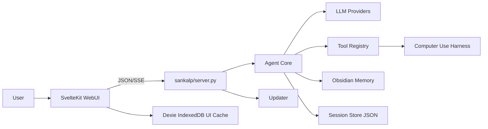
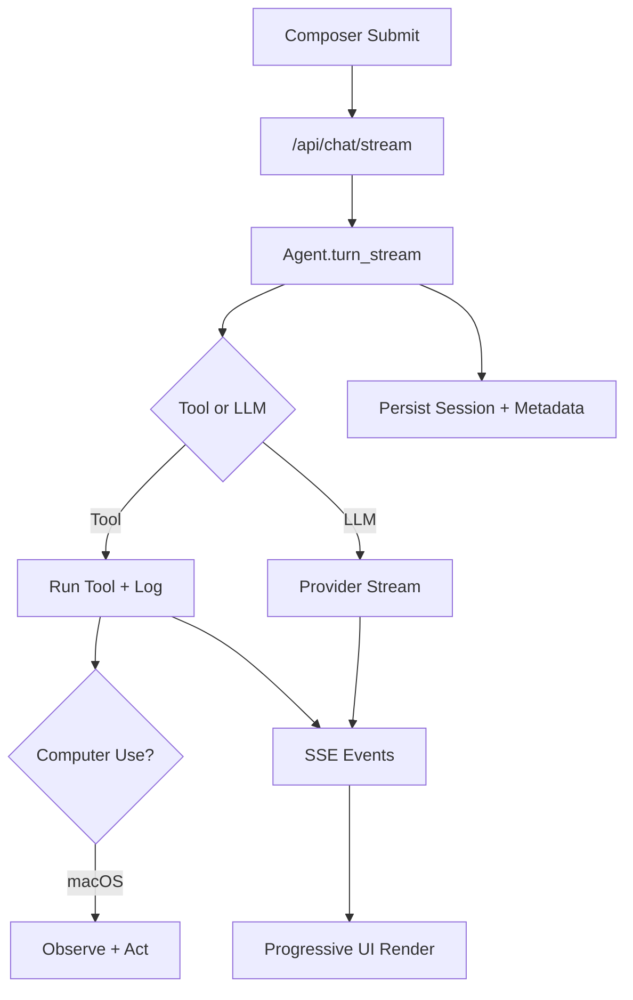

# Sankalp Architecture

Sankalp is a local-first assistant with a professional WebUI. The backend is Python API-first,
and the frontend is SvelteKit + TypeScript. User data is kept under `~/.sankalp` and survives
reinstalls/updates.

## System Boundaries

- Frontend (`web/`): routes, components, stores, services, and Dexie browser cache.
- Backend (`sankalp/`): HTTP server, typed JSON/SSE APIs, agent orchestration, providers, tools.
- User memory: Obsidian-compatible Markdown vault for human-readable long-term notes.
- Operational state: JSON sessions today (`~/.sankalp/sessions`), with SQLite (`state.db`) as
durable backend-state direction.

## Core Modules

- `sankalp/server.py`: loopback server, `/api/*`, SSE chat stream, and installed-app static serving.
- `sankalp/agent/core.py`: turn orchestration, session updates, tool routing, edit/regenerate flows.
- `sankalp/agent/llm.py`: provider adapters (`local`, `local_openai`, `codex`, `gemini`, `openai`).
- `deploy/cloud-run-vllm-qwen36/`: optional Cloud Run GPU deployment scaffold for a private
OpenAI-compatible vLLM endpoint backed by `Qwen/Qwen3.6-27B-FP8`.
- `sankalp/sessions/store.py`: JSON session persistence.
- `sankalp/memory/obsidian.py`: vault reads/writes, memory search helpers, open-note helpers.
- `sankalp/tools/registry.py`: explicit tool catalog and auditable tool-call logging.
- `sankalp/computer/*`: experimental macOS Computer Use harness, action safety policy, and
model-guided task loop. See `docs/computer-use.md` for implementation details.
- `sankalp/skills/registry.py`: folder-backed skill discovery under `~/.sankalp/skills`.
- `sankalp/updater.py`: release-manifest update checks and confirmed installer launch.

## Frontend Structure

- Route layer: `web/src/routes/+page.svelte`.
- UI layer: `web/src/lib/components/*`.
- State layer: `web/src/lib/stores/chat.ts`.
- API layer: `web/src/lib/services/api.ts` (typed fetch + SSE parsing).
- Browser storage layer: `web/src/lib/storage/db.ts` (Dexie for local UI cache/preferences).
- Slash-command picker: loaded from backend `/api/capabilities` command metadata, with a small
frontend fallback for offline startup.
- App shell layout owns the viewport; the sidebar/session list and message transcript are internal
scroll regions while the header, settings entry point, and composer stay fixed in place.

## Persistence Model

- `~/.sankalp/app`: managed application checkout (resettable by installer/update flow).
- `~/.sankalp/settings.json`: local config and provider/research settings (keys masked in API reads).
- `~/.sankalp/sessions/`: operational session JSON.
- Obsidian vault: durable user memory (`People/`, `Projects/`, `Inbox/`, `Decisions/`, `Sessions/`).
- `SOUL.md`: user-owned persona text loaded into prompts.

## Runtime Flows

- Chat flow: WebUI -> `/api/chat/stream` -> agent/tool/provider pipeline -> SSE events (`status`,
`reasoning`, `delta`, `session`, `done`) -> session + tool log persistence.
- Tool routing: deterministic command/intent routing first; safe read/search fallback via LLM tool
selection; write/terminal actions stay explicit.
- Computer Use flow: `/computer ...` commands call the macOS harness for app listing, screenshots,
accessibility-tree inspection, and explicit click/type/key actions. `/computer task ...` runs a
bounded experimental loop that observes, asks the selected model for one structured action, checks
policy, executes through the tool registry, and repeats until done/blocked/confirmed.
- Memory flow: `/remember` and natural save intents write to Obsidian with routing/fallback logic;
explicit memory-find intents route through `memory_search` first.
- Title flow: immediate fallback title, then async global smallest-model title generation
(provider-agnostic, manual renames preserved).
- External model flow: Cloud-hosted vLLM endpoints are configured through the existing
`local_openai`/OpenAI-compatible provider fields. Sankalp keeps tool execution and Computer Use
local; only model inference, including any screenshot attachments supplied by the user task, is
sent to the configured endpoint.

## Packaging and Updates

- Installed app serves one local origin: built WebUI + backend API on loopback.
- macOS and Windows installers manage `~/.sankalp/app`, preserve user-owned data, and support
Obsidian onboarding/auto-detection.
- Updates are manifest-driven (`update.json`) via `/api/app/update`; user confirms update/relaunch.

## Safety and Constraints

- Loopback-only HTTP by default.
- File tools limited to configured roots.
- Terminal tool disabled unless explicitly enabled.
- Computer Use is experimental, macOS-only, and requires user-granted Accessibility and Screen
Recording permissions. In dev mode those permissions belong to the launching app, usually Terminal
or iTerm; `Sankalp.app` is the permission target only when running the installed bundle. The policy
layer pauses before actions that may send, submit, delete, purchase, change settings, or handle
sensitive data.
- Tool-call audit trail (inputs, outputs, status, timestamps).

## Architecture Diagrams

### High-Level System View

### Chat Streaming Runtime Flow

