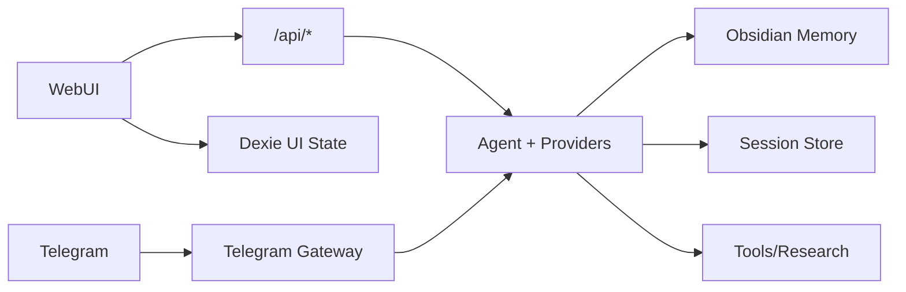

# Sankalp Features

This file is the minimal, user-facing feature map for the current product.

## Chat and Sessions

- Session persistence with JSON-backed local history.
- Streaming chat responses in WebUI (status/reasoning/content/session events).
- Edit-and-resend branching for earlier user turns.
- Rename, export, and delete conversations from the sidebar.
- Fixed app chrome: sidebar, settings controls, and composer stay in place while message history
  scrolls independently.
- Async auto-title generation with global smallest-model routing; manual titles are preserved.

## Composer and Inputs

- Per-message provider/model/reasoning selection.
- Provider-scoped model memory in WebUI (switching provider keeps its own model choice).
- Attach `.md`, `.txt`, `.pdf`, and images.
- Enter to send, Shift+Enter for newline.
- Slash-command picker when typing `/`, backed by the backend capabilities command catalog.

## Providers

- Built-in providers: `local`, `local_openai`, `codex`, `gemini`, `openai`.
- Provider settings are local-first and persisted in `~/.sankalp/settings.json`.
- `/api/models?provider=...` model loading with runtime fallback behavior.
- `Test hello` connection check without creating a chat session.

## Memory

- Obsidian-compatible Markdown vault integration.
- `/remember` for durable memory capture.
- Natural-language save/document intents routed to memory capture.
- Explicit memory find/check intents routed to `memory_search` first.
- Session deletion also removes matching Obsidian session transcript.

## Tools and Research

- Core tools include memory, web fetch/search, file read/append, and optional terminal.
- Tool calls are logged in session activity for auditability.
- `/research <query>` for web discovery + synthesis with source links.
- `/fetch <url>` for readable-content extraction with provider-aware fallback.
- Experimental macOS Computer Use via `/computer ...`: list visible apps, inspect accessibility
  trees, capture screenshots, open apps, click/type/key/scroll explicit targets, and run a bounded
  low-risk `/computer task <instruction>` loop. Implementation details live in `docs/computer-use.md`.
- `/computer permissions [accessibility|screen]` opens the macOS Privacy panes needed by the
  experimental harness.
- In dev mode, macOS permissions are granted to the launching app such as Terminal, iTerm, or
  Antigravity; `Sankalp.app` appears only when running the installed app bundle.
- Computer Use pauses before high-impact actions such as sending, deleting, purchasing, changing
  settings, or handling passwords, OTPs, API keys, and other sensitive data.

## Daemon and Messaging Gateway

- Foreground daemon entry point with `python3 -m sankalp.daemon`.
- Optional Telegram gateway configured in `Settings -> Gateway`.
- Telegram access is allowlisted by default through saved allowed user IDs.
- Per-chat Telegram sessions persist under `~/.sankalp/gateway/telegram.json`.
- Gateway commands include `/start`, `/help`, `/whoami`, `/status`, and `/new`.
- Dev relaunch starts the daemon; macOS install adds a user LaunchAgent with `RunAtLoad` and
  `KeepAlive`.
- Installed macOS builds include a minimal menu-bar item showing live/offline state, the local base
  URL with copy action, and actions to open the WebUI or restart the daemon. When the release
  manifest reports a newer build, the menu also shows `Update Sankalp` and starts the same update
  flow as the WebUI. The menu-bar app keeps a single-instance lock so opening Sankalp again does not
  create a second icon.

## Skills and Capabilities

- Folder-backed skills under `~/.sankalp/skills`.
- Bundled default skills are seeded only when missing.
- `Settings -> Capabilities` lists features, skills, tools, and slash commands.

## Installed App Experience

- macOS and Windows one-command installer flows.
- Managed app checkout under `~/.sankalp/app`; user data remains separate and durable.
- Single local origin for built WebUI + backend API.
- In-app update checks and confirmed update/relaunch via release manifest (`update.json`).
- App controls include restart and quit local app.

## Architecture Diagram

